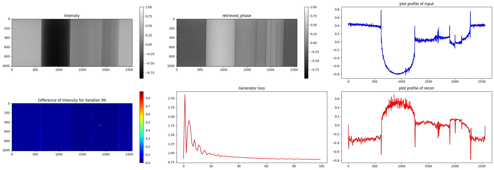
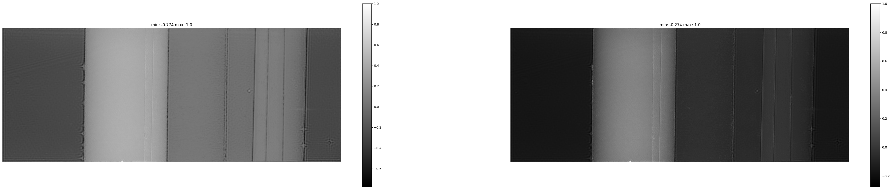
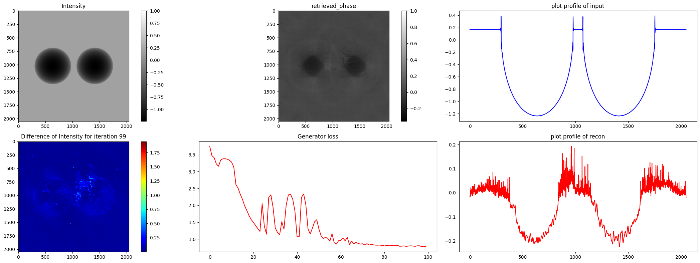
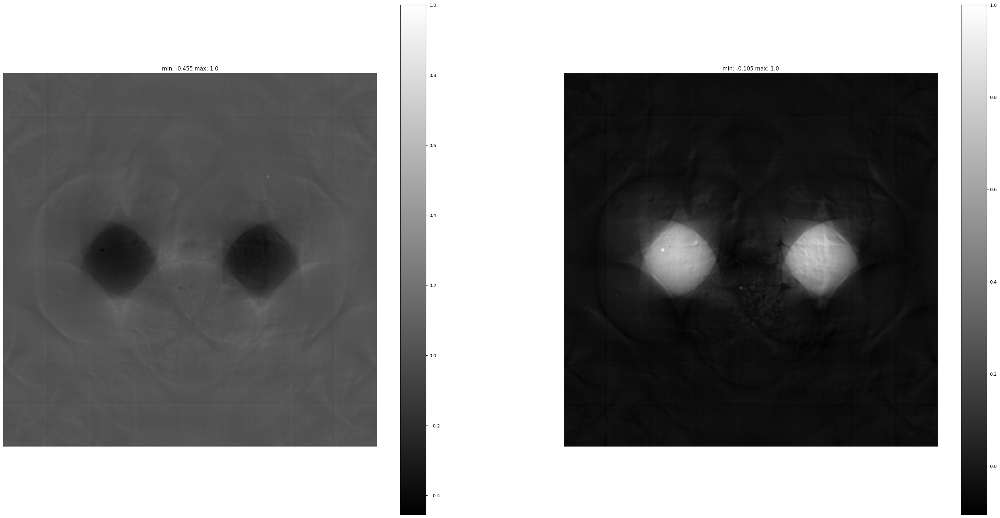
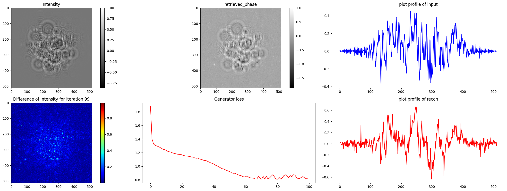
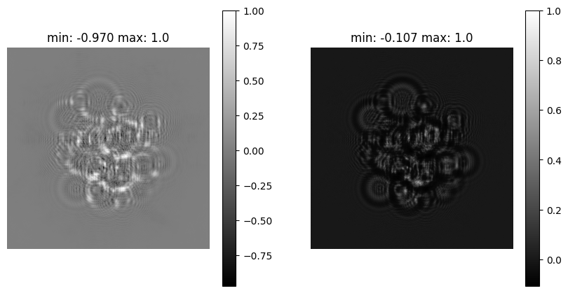

# GANrec for Phase Retrieval

---

Using GANrec for Phase retrieval is a machine learning method of retrieving the phase from a single distance detected image.

## Model outlook

### the design of the model:

### the architecture of the model

---

# Results for different experiments

## 1. For the phantom data

> After 1300 iterations:
> 
> *tf.Tensor: shape=(1,), dtype=float32, numpy=array([0.9426766], type=float32)*

| Model           | Iteration | G_loss             | D_loss             | SSIM       | PSNR | time |
| --------------- | --------- | ------------------ | ------------------ | ---------- | ---- | ---- |
| model_generator | 100       | 0.5252670645713806 | 3.493865966796875  | 0.38239267 |      |      |
|                 | 400       | 0.8212271332740784 | 1.4829493761062622 |            |      |      |
|                 | 500       | 0.9681499600410461 | 1.434912919998169  |            |      |      |
|                 | 800       | 0.7757389545440674 | 1.410948395729065  |            |      |      |
|                 | 1000      | 0.8766704201698303 | 1.396097183227539  |            |      |      |
|                 | 1200      | 0.7798200249671936 | 1.3912122249603271 |            |      |      |
|                 | 1300      | 0.9134629368782043 | 1.3979194164276123 | 0.9426766  |      | 9'   |

## 2. For the Simulation data

> After 1300 iterations:
> 
> *tf.Tensor: shape=(1,), dtype=float32, numpy=array([0.9869069], type=float32)*

| Model           | Iteration | G_loss             | D_loss             | SSIM      | PSNR | time |
| --------------- | --------- | ------------------ | ------------------ | --------- | ---- | ---- |
| model_generator | 100       | 0.7840274572372437 | 2.4736170768737793 |           |      |      |
|                 | 400       | 0.8808481097221375 | 1.65756094455719   |           |      |      |
|                 | 500       | 0.8498396277427673 | 1.65756094455719   |           |      |      |
|                 | 800       | 0.8882272243499756 | 1.3864026069641113 |           |      |      |
|                 | 1000      | 0.7862778902053833 | 1.3896679878234863 |           |      |      |
|                 | 1200      | 0.7478931546211243 | 1.379651665687561  |           |      |      |
|                 | 1300      | 0.751545786857605  | 1.3673007488250732 | 0.9869069 |      | 17'  |

## 3. For the holo data

> After 1300 iterations:
> 
> *tf.Tensor: shape=(1,), dtype=float32, numpy=array([0.9899711], type=float32)*

| Model           | Iteration | G_loss             | D_loss             | SSIM      | PSNR | time   |
| --------------- | --------- | ------------------ | ------------------ | --------- | ---- | ------ |
| model_generator | 100       | 0.8157875537872314 | 1.9476568698883057 |           |      |        |
|                 | 400       | 0.8255200386047363 | 1.8638721704483032 |           |      |        |
|                 | 500       | 0.8071261644363403 | 1.5162357091903687 |           |      |        |
|                 | 800       | 0.7775182723999023 | 1.412088394165039  |           |      |        |
|                 | 1000      | 0.7542343735694885 | 1.400909423828125  |           |      |        |
|                 | 1200      | 0.7404253482818604 | 1.3978853225708008 |           |      |        |
|                 | 1300      | 0.7355071902275085 | 1.397374153137207  | 0.9899711 |      | 1'19'' |

# Adjusting the abs_ratio, g_learning rate and loading a model

Iteration = 300

> | abs_ratio      | G_loss                       | D_loss                       | SSIM                |
> | -------------- | ---------------------------- | ---------------------------- | ------------------- |
> | 0              | 5.757208824157715            | 0.1425950825214386           | 0.00599256          |
> | 0.5            | 0.7498464584350586           | 2.759634494781494            | 0.3462228           |
> | **0.05** | **0.7660830616950989** | **2.6683266162872314** | **0.3380415** |
> | 0.005          | 0.7711102962493896           | 2.6628589630126953           | 0.3379896           |

with *g_learnign_rate = 1e-5* and *phase only*

> Iteration 300: G_loss is 7.833169937133789 and D_loss is 0.017081953585147858
> Running time is 137.8858585357666
> E0fft shape:  (1015, 2560) H shape:  (1015, 2560)
> SSIM between the input image and the reconstructed image is [0.00231877]
>
> **Note: g_learning_rate shouldn't be lower than 1e-3 (or higher -> SSIM = nan)**

Training with a previous weight!

| load_h5 | iter | G_loss             | D_loss             | SSIM       |
| ------- | ---- | ------------------ | ------------------ | ---------- |
| False   | 100  | 0.5443984270095825 | 3.8580539226531982 | 0.4052531  |
| True    | 100  | 0.5837660431861877 | 3.623978853225708  | 0.24803953 |
