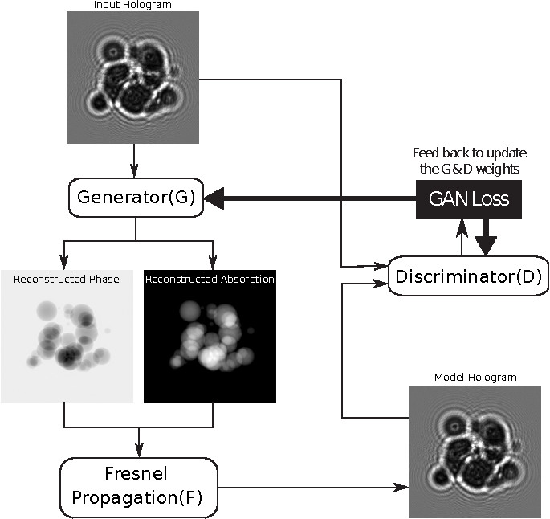
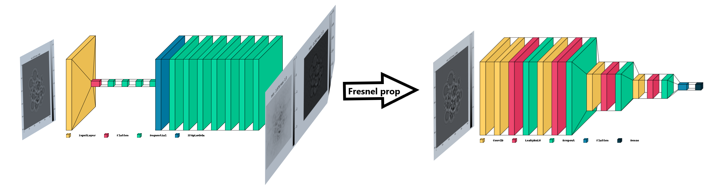
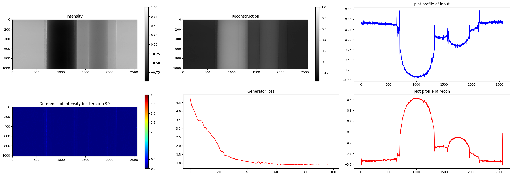
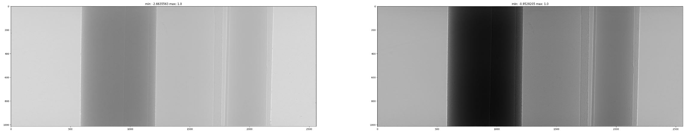
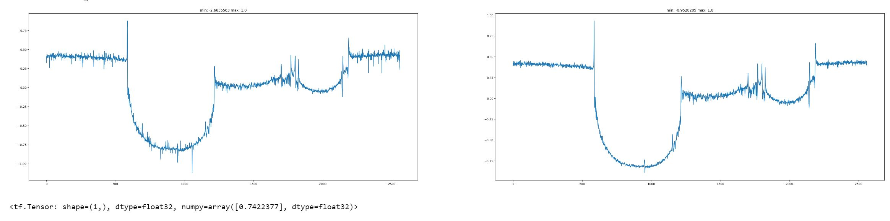

# GANrec for Phase Retrieval

---

Using GANrec for Phase retrieval is a machine learning method of retrieving the phase from a single distance detected image.

## Model outlook

### the design of the model:

### the architecture of the model

---

# For phantom projection:

---

# model_results

| Model                     | Iteration      | G_loss                      | D_loss                       | SSIM                | PSNR               | time         |
| ------------------------- | -------------- | --------------------------- | ---------------------------- | ------------------- | ------------------ | ------------ |
| model_generator_rev       | 100            | 0.5252670645713806          | 3.493865966796875            | 0.38239267          |                    | 1''          |
| model_generator_rev       | 500            | 0.8400967121124268          | 1.8466062545776367           | 0.42755893          |                    | 4'           |
| model_generator_rev       | 1000           | 0.7979649901390076          | 1.5719962120056152           | 0.58666307          |                    | 9'           |
| **model_generator** | **1000** | **0.781958937644958** | **1.4627526998519897** | **0.7422442** | **29.98487** | **7'** |
| u_net                     | 100            | 1.5755401849746704          | 1.7901132106781006           | 0.69                |                    | 52''         |

Iteration 1000: G_loss is 1.5755401849746704 and D_loss is 1.7901132106781006

 

Iteration = 300

> | abs_ratio      | G_loss                       | D_loss                       | SSIM                |
> | -------------- | ---------------------------- | ---------------------------- | ------------------- |
> | 0              | 5.757208824157715            | 0.1425950825214386           | 0.00599256          |
> | 0.5            | 0.7498464584350586           | 2.759634494781494            | 0.3462228           |
> | **0.05** | **0.7660830616950989** | **2.6683266162872314** | **0.3380415** |
> | 0.005          | 0.7711102962493896           | 2.6628589630126953           | 0.3379896           |

with *g_learnign_rate = 1e-5* and *phase only*

> Iteration 300: G_loss is 7.833169937133789 and D_loss is 0.017081953585147858
> Running time is 137.8858585357666
> E0fft shape:  (1015, 2560) H shape:  (1015, 2560)
> SSIM between the input image and the reconstructed image is [0.00231877]
>
> **Note: g_learning_rate shouldn't be lower than 1e-3 (or higher -> SSIM = nan)**

Training with a previous weight!

| load_h5 | iter | G_loss             | D_loss             | SSIM       |
| ------- | ---- | ------------------ | ------------------ | ---------- |
| False   | 100  | 0.5443984270095825 | 3.8580539226531982 | 0.4052531  |
| True    | 100  | 0.5837660431861877 | 3.623978853225708  | 0.24803953 |

---

# For simulated spheres

For the simulation data,

1. without initializing the model with previously trained
2. 500 iteration
3. result:

Noise to signal ratio is [28.46919],

SSIM between the input image and the reconstructed image is [0.9556593]

# RESULT SO FAR!
